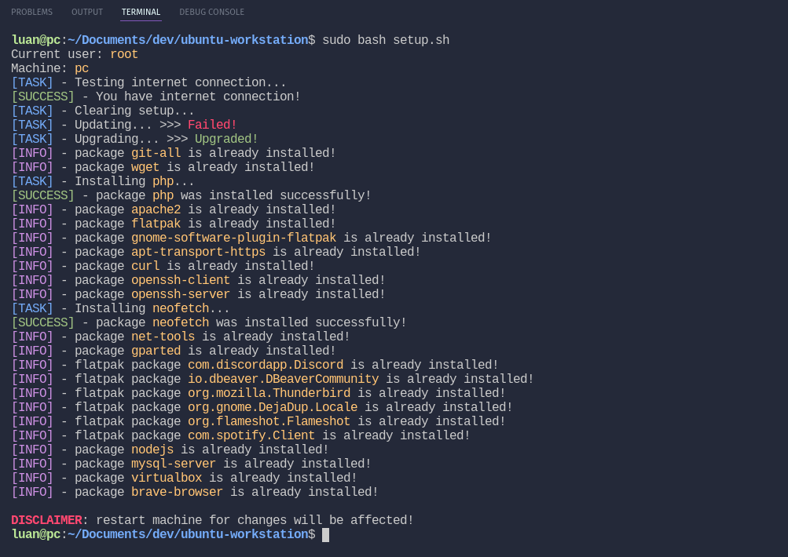

# Linux workstation

Downloader and installer utility of packages for Debian-based Linux distributions.

<br/>

# How to use

Inside project directory, run:

```bash
sudo bash setup.sh # run main script and let magic happen
```

## Terminal print

<br/>

Script output in terminal for example:



# TESTED ON

| **Distro** | **Codename** | **Version** | **GNU Bash** |
| ---------- | ------------ | ----------- | ------------ |
| Debian     | _bullseye_   | 11          | 5.1.4        |
| PopOS      | _jammy_      | 22.04       | 5.1.16       |
| PopOS      | _impish_     | 21.10       | 5.1.8        |
